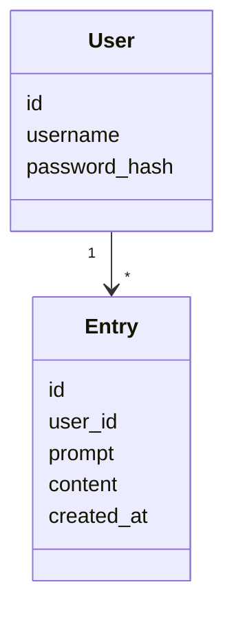
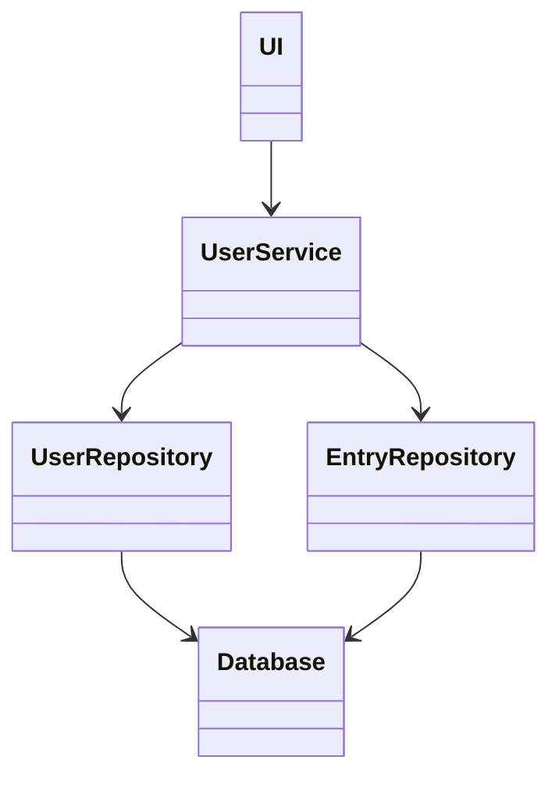
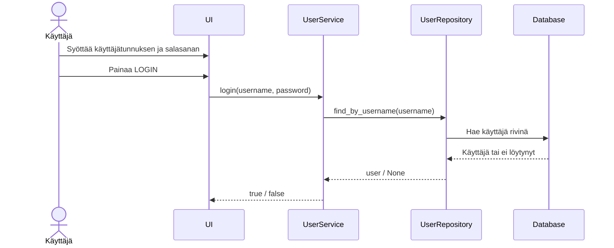
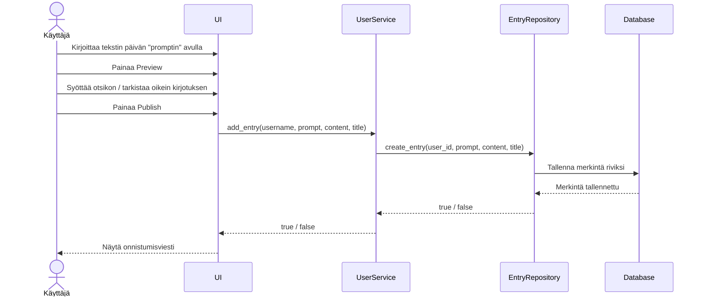

# Arkkitehtuurikuvaus

## Rakenne

## käyttöliittymä
Käyttöliittymään kuuluu 4 näkymää toistaiseksi:
- sign up
- login
- startpage
- logged in page
- Daily prompt page
- my entries page

## Sovelluslogiikka
Sovellukseen on nyt lisätty tietokanta sqlite3, jossa on käyttäjät ja "journal entries"

Sovelluksen tietomallin muodostavat luokat

ohjelman osien suhdetta kuvaava kaavio

Kirjautumisen sekvenssikaavio

Päiväkirjamerkinnän luomisen sekvenssikaavio

