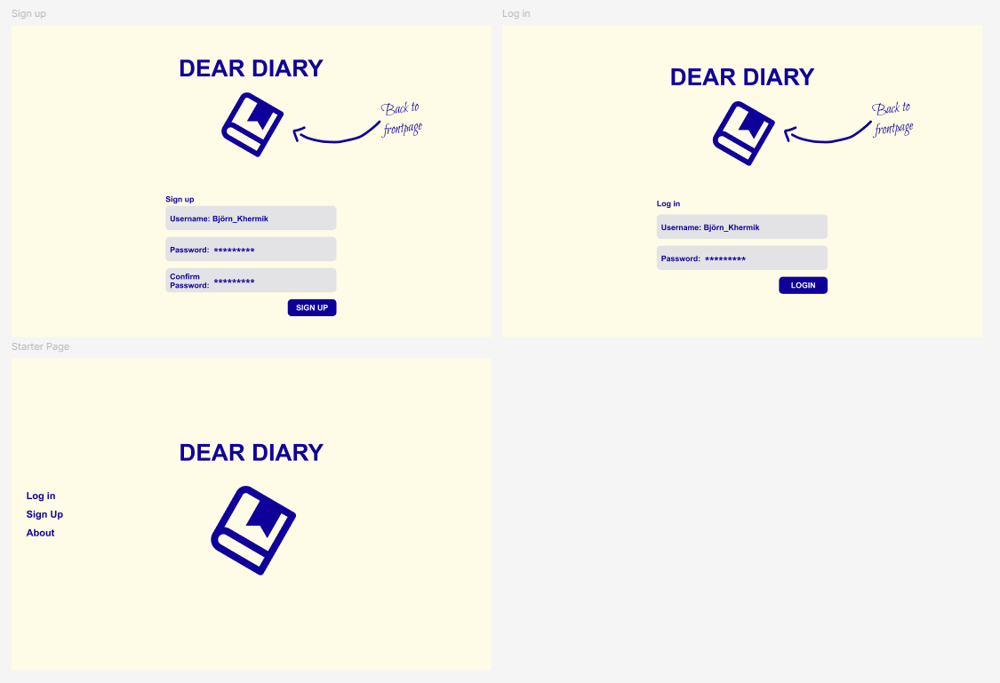
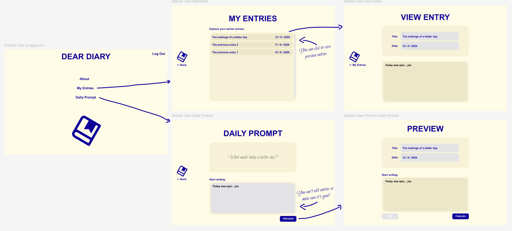
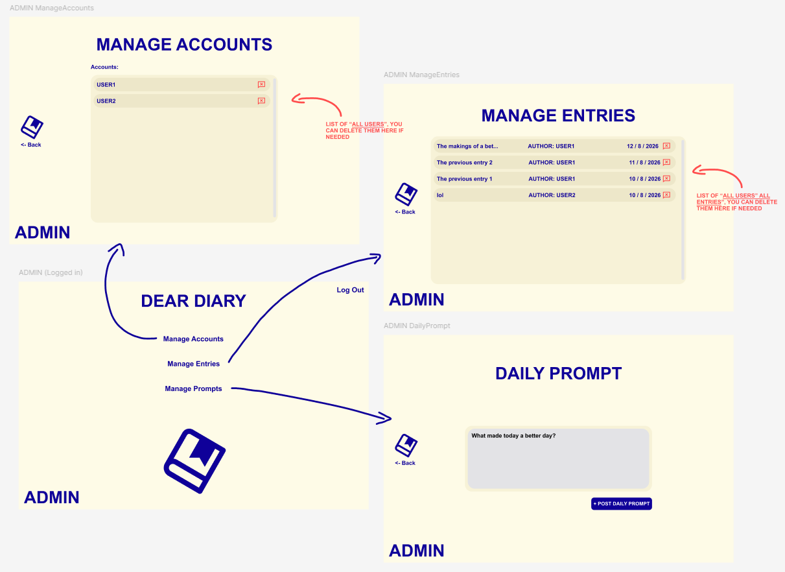

# Dear Diary - Requiriments Specification / Vaatimusmäärittely

## What the app is for

The "Dear Diary" app is meant to work as a digital diary application. The app enables users to create an account, Write into your daily diary with the help/inspiration of a daily prompt to guide your thought. You can then explore your earlier diary entries. The app has an admin account that can change the daily prompt, controll accounts and even delete anyones entry if needed.

## Users

At the start of this project there is only going to be one user that is the "default/customer" user. The "Default User" can answer the daily prompt and view his earlier entries. Later on I intend to add an admin account with speacial pages and functionality to change data within the app.

## UserInterface

At the start I will focus on making the "Defaul User" pages that are at the bottom and later add the admin pages as seen in the photo below.

StartingPage -> Login/SignUp/About -> MainPage -> 3 options 1.(About) 2.(My Entries) 3.(Daily prompt)

## Starting (MVP) Functionality

### Before Log-in

- User can create an account (DONE!)

- User can create an account (DONE!)
  - The account Username must be unique (DONE!)
  - The Sign up phase requires to fill out all mandatory fields (DONE!)
- User can log in (DONE!)
  - The log in goes through if the Username and Password are correct (DONE!)
  - If the account doesn't exsist of the password is wrong the app will have a notification (DONE!)

### After Log-in

- The User is brought to the MainPage (DONE!)
- The User can go to the about pop-up. (DONE!)
  - View more information about the app. (DONE!)
- The User can go to the Daily prompt page (DONE!)
  - Go back to the Main page. (DONE!)
  - Fill/type out the daily prompt. (DONE!)
  - Preview it before publishing it and add title. (DONE!)
  - Can go back to edit the entry before publishing. (DONE!)
- The User can go to My Entries page (DONE!)
  - To view all his previous entries in a list view (DONE!)
  - Go back to the Mainpage (DONE!)

## Information Storage

- The User information will be stored in a SQLite3-database.

## Future Development ideas

- Admin functionality
- Mood meter to track mood when typing
  - ability to view moody graph
- Free typing mode without daily prompt
- Publish public poems or essays
  - That other Users can view
